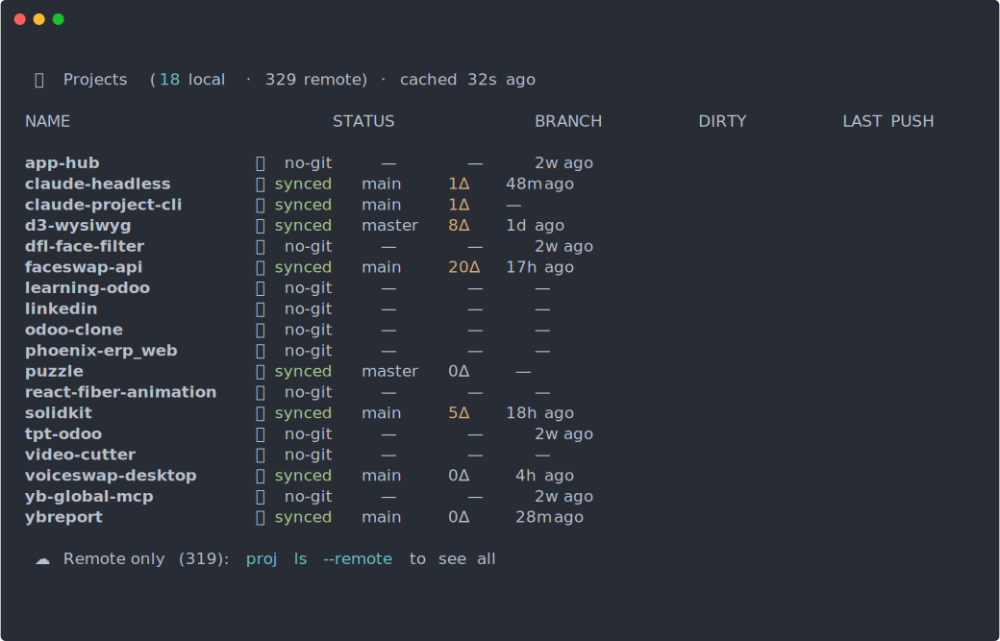
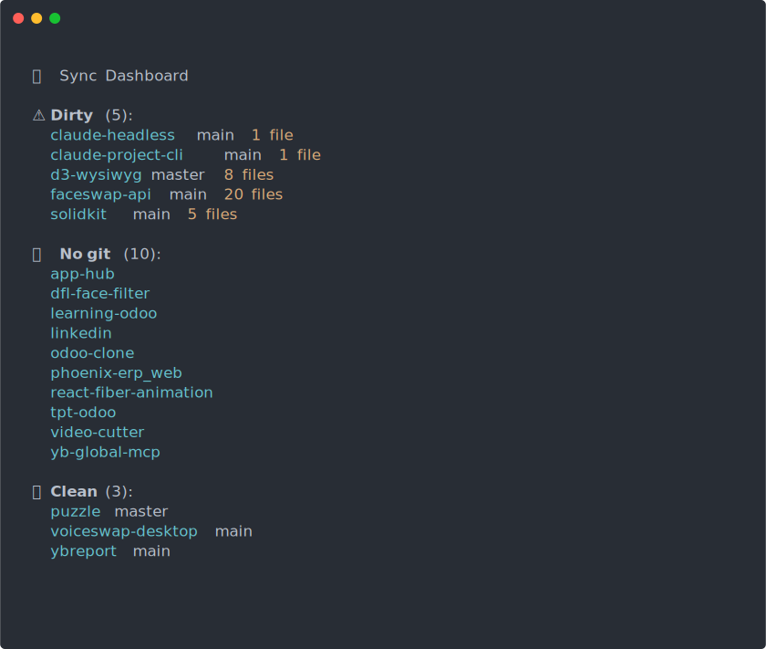
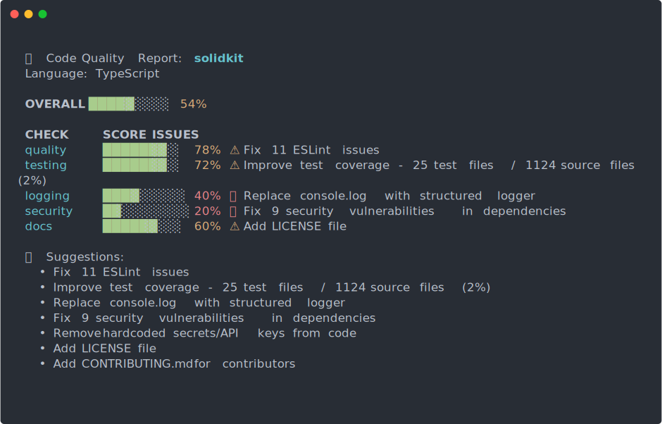

# proj

**Fast CLI for managing all your projects — local + GitHub sync, fuzzy search, instant navigation, seamless Claude Code integration**

[](https://crates.io/crates/proj)
[](LICENSE)
[](https://github.com/ybouhjira/proj/actions)
[](https://crates.io/crates/proj)

## Why proj?

Managing dozens of projects is chaotic:
- **You forget what exists** — Projects scattered across your machine, some on GitHub only
- **Navigation is slow** — `cd ~/Projects/that-repo-from-3-months-ago` gets tedious
- **Sync status is unclear** — Which repos need pushing? Which have uncommitted changes?
- **Context switching kills flow** — Every directory change breaks your mental model
- **Opening projects manually is tedious** — Launching editors, navigating to repos

`proj` solves this with a unified dashboard, instant fuzzy navigation, smart sync tracking, and seamless Claude Code integration. Built as a Claude Code-first project manager — create, navigate, and open projects in Claude Code with a single command.

## Demo

<p align="center">
  
</p>

<p align="center">
  
</p>

<p align="center">
  
</p>

<details>
<summary>Text-based demo (for terminals without SVG support)</summary>

```bash
$ proj ls
  📦 Projects (18 local · 327 remote)

 NAME                    STATUS      BRANCH   DIRTY   LAST PUSH
 faceswap-api            ✅ synced   main     10∆     15h ago
 solidkit                ✅ synced   main     5∆      16h ago
 d3-wysiwyg              ✅ synced   master   8∆      1d ago
 voiceswap-desktop       ✅ synced   main     0∆      2h ago
 app-hub                 📁 no-git   —        —       2w ago

$ proj cd face
# Instantly jumps to /home/user/Projects/faceswap-api

$ proj sync
  🔄 Sync Dashboard

  ⚠ Dirty (4):
    faceswap-api main  10 files
    d3-wysiwyg master  8 files

  💻 No git (11):
    app-hub, dfl-face-filter, ...

  ✅ Clean (3):
    voiceswap-desktop main

$ proj check solidkit
  🔍 Code Quality Report: solidkit
  Language: TypeScript

  OVERALL  █████░░░░░   54%

  📊 Quality      ████░░░░░░   40% (2/5 checks)
    ✅ TypeScript config found
    ✅ ESLint config found
    ❌ Prettier config not found
    ❌ No lint script in package.json
    ❌ EditorConfig not found

  🧪 Testing      ██████░░░░   60% (3/5 checks)
    ✅ Vitest configured
    ✅ Test script found
    ✅ 15 test files found
    ❌ Coverage < 80% (current: 45%)
    ❌ No E2E tests found
```
</details>

## Installation

### One-Liner (Recommended)

```bash
curl -fsSL https://raw.githubusercontent.com/ybouhjira/proj/main/install.sh | sh
```

This automatically:
- Downloads the latest binary for your platform
- Installs shell integration (zsh/bash/fish)
- Sets up completions
- Installs man pages

### Alternative Methods

<details>
<summary>From crates.io (requires Rust)</summary>

```bash
cargo install proj
```

Then set up shell integration manually:
```bash
# Add to ~/.zshrc or ~/.bashrc
proj() {
    if [ "$1" = "cd" ]; then
        shift
        local dir=$(command proj cd "$@" 2>&1)
        if [ $? -eq 0 ] && [ -n "$dir" ] && [ -d "$dir" ]; then
            builtin cd "$dir"
        else
            echo "$dir" >&2
        fi
    else
        command proj "$@"
    fi
}
```
</details>

<details>
<summary>From source</summary>

```bash
git clone https://github.com/ybouhjira/proj
cd proj
cargo build --release
sudo cp target/release/proj /usr/local/bin/
```
</details>

<details>
<summary>oh-my-zsh plugin</summary>

```bash
# Clone into oh-my-zsh custom plugins
git clone https://github.com/ybouhjira/proj \
  ${ZSH_CUSTOM:-~/.oh-my-zsh/custom}/plugins/proj

# Add to plugins in ~/.zshrc
plugins=(... proj)

# Reload shell
source ~/.zshrc
```

Get aliases: `p`, `pl`, `pcd`, `psync`, `pcheck`, `pnew`, `pinfo`, `popen`
</details>

<details>
<summary>Homebrew (coming soon)</summary>

```bash
brew install ybouhjira/tap/proj
```
</details>

## Quick Start

```bash
# List all projects (local + GitHub)
proj ls

# Fuzzy search and jump to a project
proj cd myproject

# Open a project in Claude Code (interactive picker)
proj open

# Open a specific project in Claude Code
proj open myproject

# See what needs attention
proj sync

# Run quality checks
proj check myproject

# Create a new project (local + GitHub, auto-opens in Claude Code)
proj new my-new-project

# Generate shell completions
proj completions zsh > ~/.zsh/completions/_proj
```

## Features

- 🚀 **Instant fuzzy search** — `proj cd face` finds `faceswap-api` in milliseconds
- 📊 **Unified dashboard** — See all local + GitHub repos in one view
- 🔄 **Smart sync tracking** — Know which repos are dirty, ahead, behind, or untracked
- 🎯 **Quality checks** — Lint, test, security, and documentation analysis
- 🌐 **GitHub integration** — Clone, create, and browse repos without leaving terminal
- ⚡ **Blazing fast** — Written in Rust, sub-second response times
- 🔍 **Rich metadata** — Language, stars, last push time, dirty file count
- 💾 **Response caching** — GitHub API responses cached locally (5min TTL)
- 🛠️ **Shell integration** — `cd` wrapper for instant navigation
- 📝 **Shell completions** — Tab completion for bash, zsh, fish, powershell
- 🎨 **Interactive picker** — No args? Get a fuzzy-searchable project list with status indicators
- 🤖 **Claude Code integration** — Launch Claude Code directly from the CLI, auto-open on project creation
- 📦 **Remote project cloning** — Select remote-only projects in the picker to auto-clone them
- 📖 **Man pages** — Full documentation via `man proj`

## Commands

| Command | Description | Key Flags |
|---------|-------------|-----------|
| `proj ls` | List all projects (local + remote) | `--local`, `--remote`, `--all`, `--sort <name\|push\|dirty\|status>`, `--refresh` |
| `proj cd [query]` | Fuzzy search and jump to project | Interactive picker if no query |
| `proj sync` | Show sync status dashboard | `--ai` for recommendations |
| `proj clone <name>` | Clone a GitHub repo to projects dir | `--org <name>` for org repos |
| `proj new <name>` | Create new project (local + GitHub), auto-open in Claude Code | `--public` (default: private) |
| `proj open [name]` | Open project in Claude Code | Interactive picker if no name. Remote-only projects can be auto-cloned. `--github` to open on GitHub instead |
| `proj info <name>` | Show detailed project information | `--json` for machine-readable output |
| `proj check [name]` | Run quality checks (linters, tests) | `--all` to check all projects |
| `proj completions <shell>` | Generate shell completions | `bash`, `zsh`, `fish`, `powershell` |

### Examples

```bash
# List projects sorted by last push time
proj ls --sort push

# Refresh GitHub cache and show only remote repos
proj ls --remote --refresh

# Jump to a project (fuzzy search)
proj cd voice

# Open interactive picker to select and navigate to a project
proj cd

# Open interactive picker and launch a project in Claude Code
proj open

# Open a specific project in Claude Code
proj open faceswap-api

# Create a new private GitHub repository and open it in Claude Code
proj new my-awesome-tool

# Create a new public GitHub repository and open it in Claude Code
proj new my-awesome-tool --public

# Open project on GitHub in browser
proj open faceswap-api --github

# Run quality checks on all projects
proj check --all

# Get project info as JSON
proj info solidkit --json
```

## proj check — Quality Analysis

`proj check` runs comprehensive quality analysis on your projects:

```
🔍 Code Quality Report: solidkit
Language: TypeScript

OVERALL  ████████░░   78%

📊 Quality      ████████░░   80% (4/5 checks)
  ✅ TypeScript config found
  ✅ ESLint config found
  ✅ Prettier config found
  ✅ Lint script in package.json
  ❌ EditorConfig not found

🧪 Testing      ██████░░░░   60% (3/5 checks)
  ✅ Vitest configured
  ✅ Test script found
  ✅ 15 test files found
  ❌ Coverage < 80% (current: 45%)
  ❌ No E2E tests found

📝 Logging      ████░░░░░░   40% (2/5 checks)
  ✅ Logging library found (pino)
  ✅ Structured logging detected
  ❌ No log rotation config
  ❌ No log aggregation setup
  ❌ Missing log levels docs

🔒 Security     ████████░░   80% (4/5 checks)
  ✅ No hardcoded secrets
  ✅ Dependencies up to date
  ✅ No known vulnerabilities
  ✅ Dependabot enabled
  ❌ No security policy (SECURITY.md)

📚 Documentation ██████████   100% (5/5 checks)
  ✅ README.md present
  ✅ Contributing guide found
  ✅ License file present
  ✅ API documentation found
  ✅ Changelog present
```

### Check Categories

- **Code Quality** — TypeScript/ESLint/Prettier configs, linting scripts, editor configs
- **Testing** — Unit tests, integration tests, coverage, E2E tests
- **Logging** — Structured logging, rotation, aggregation, best practices
- **Security** — Secret scanning, dependency auditing, vulnerability checks
- **Documentation** — README, contributing guides, API docs, changelog

## Shell Integration

### oh-my-zsh Plugin Aliases

If using the oh-my-zsh plugin, you get these aliases:

| Alias | Command | Description |
|-------|---------|-------------|
| `p` | `proj` | Main command |
| `pl` / `pls` | `proj ls` | List projects |
| `pcd` | `proj cd` | Jump to project |
| `psync` | `proj sync` | Sync dashboard |
| `pcheck` | `proj check` | Quality checks |
| `pnew` | `proj new` | Create project |
| `pinfo` | `proj info` | Project info |
| `popen` | `proj open` | Open project |

### Manual Setup

If not using oh-my-zsh, add this to your shell config:

<details>
<summary>Zsh (~/.zshrc)</summary>

```zsh
proj() {
    if [ "$1" = "cd" ]; then
        shift
        local dir=$(command proj cd "$@" 2>&1)
        if [ $? -eq 0 ] && [ -n "$dir" ] && [ -d "$dir" ]; then
            builtin cd "$dir"
        else
            echo "$dir" >&2
        fi
    else
        command proj "$@"
    fi
}

# Completions
fpath=(~/.zsh/completions $fpath)
autoload -Uz compinit && compinit
```
</details>

<details>
<summary>Bash (~/.bashrc)</summary>

```bash
proj() {
    if [ "$1" = "cd" ]; then
        shift
        local dir=$(command proj cd "$@" 2>&1)
        if [ $? -eq 0 ] && [ -n "$dir" ] && [ -d "$dir" ]; then
            builtin cd "$dir"
        else
            echo "$dir" >&2
        fi
    else
        command proj "$@"
    fi
}

# Completions
source ~/.bash_completions/proj
```
</details>

<details>
<summary>Fish (~/.config/fish/functions/proj.fish)</summary>

```fish
function proj
    if test "$argv[1]" = "cd"
        set -e argv[1]
        set dir (command proj cd $argv 2>&1)
        if test $status -eq 0; and test -n "$dir"; and test -d "$dir"
            builtin cd "$dir"
        else
            echo "$dir" >&2
        end
    else
        command proj $argv
    end
end
```

Completions are auto-loaded from `~/.config/fish/completions/proj.fish`.
</details>

## Debugging

Enable debug logging with the `PROJ_LOG` environment variable:

```bash
# Detailed debug output
PROJ_LOG=debug proj ls

# High-level operations only
PROJ_LOG=info proj open myapp

# Very verbose trace output
PROJ_LOG=trace proj cd face
```

Available log levels: `trace`, `debug`, `info`, `warn`, `error`

This is useful for troubleshooting project discovery, GitHub API calls, fuzzy matching, and Claude Code launching.

## Comparison

| Feature | proj | ghq | gita | mani |
|---------|------|-----|------|------|
| Unified local + remote view | ✅ | ❌ | ❌ | ❌ |
| Fuzzy search navigation | ✅ | ⚠️ (via fzf) | ❌ | ❌ |
| Dirty file tracking | ✅ | ❌ | ✅ | ❌ |
| GitHub integration | ✅ | ⚠️ (basic) | ❌ | ❌ |
| Quality checks | ✅ | ❌ | ❌ | ❌ |
| Sync dashboard | ✅ | ❌ | ⚠️ (basic) | ❌ |
| Response caching | ✅ | ❌ | ❌ | ❌ |
| Interactive picker | ✅ | ❌ | ❌ | ❌ |
| Claude Code integration | ✅ | ❌ | ❌ | ❌ |
| Auto-clone remote repos | ✅ | ❌ | ❌ | ❌ |
| Shell completions | ✅ | ⚠️ (limited) | ❌ | ❌ |
| Written in Rust | ✅ | ✅ | ❌ (Python) | ❌ (Go) |
| Shell CD integration | ✅ | ✅ | ❌ | ❌ |

`proj` combines the best of all worlds: fast like `ghq`, smart like `gita`, GitHub-native, and optimized for Claude Code workflows.

## Configuration

Create `~/.config/proj/config.toml`:

```toml
# Where your projects live
projects_dir = "~/Projects"

# Your GitHub username (for listing remote repos)
github_username = "ybouhjira"

# Patterns to exclude from discovery
exclude_patterns = [
    "node_modules",
    "target",
    ".git",
    "vendor"
]

# Cache TTL (in seconds, default: 300)
cache_ttl = 300

# Custom quality checks
[checks]
rust = ["cargo clippy", "cargo test"]
typescript = ["npm run lint", "npm test"]
python = ["ruff check", "pytest"]

# Claude Code integration
[claude]
default_args = ["--dangerously-skip-permissions", "--model=opus"]
```

### Environment Variables

- `GITHUB_TOKEN` — GitHub personal access token (required for private repos)
- `PROJ_PROJECTS_DIR` — Override projects directory
- `PROJ_CACHE_TTL` — Cache TTL in seconds (default: 300)

## Roadmap

**v0.3** (in progress):
- ⚙️ Project templates and scaffolding
- 📊 Activity statistics and insights
- 🔗 GitLab and Bitbucket support
- 📦 Homebrew formula

**v0.4** (planned):
- 🏷️ Project tags and filtering
- 👀 Watch mode for continuous sync monitoring
- 📈 Contribution graph visualization
- 🎨 Custom themes and output formats
- 📦 Multi-directory project roots

**Future**:
- 🤖 Automated dependency updates
- 🚀 CI/CD integration and monitoring
- 🔔 Slack/Discord notifications
- 📱 Mobile companion app

Want a feature? [Open an issue](https://github.com/ybouhjira/proj/issues)!

## Contributing

Contributions welcome! Here's how:

1. **Fork the repo** — `gh repo fork ybouhjira/proj --clone`
2. **Create a branch** — `git checkout -b feature/my-feature`
3. **Make changes** — Follow Rust style guidelines (`cargo fmt`, `cargo clippy`)
4. **Add tests** — All new features need tests
5. **Submit PR** — Include a clear description of the change

### Development

```bash
# Run tests
cargo test

# Run with debug output
PROJ_LOG=debug cargo run -- ls --local

# Build release binary
cargo build --release

# Install locally
cargo install --path .

# Generate man pages
cargo xtask man

# Record terminal demos
./scripts/record-demos.sh
```

### Project Structure

```
proj/
├── src/
│   ├── main.rs           # CLI entry point
│   ├── commands/         # Command implementations
│   ├── github/           # GitHub API client
│   ├── cache/            # Response caching
│   ├── checks/           # Quality check runners
│   └── fuzzy/            # Fuzzy search engine
├── plugins/
│   └── oh-my-zsh/        # oh-my-zsh plugin
├── man/                  # Man pages
├── demo/                 # Terminal recordings (SVG)
└── install.sh            # Installation script
```

## License

MIT License - see [LICENSE](LICENSE) file for details.

---

Built with ⚡ by [Youssef Bouhjira](https://github.com/ybouhjira)

**Star the repo if `proj` saves you time!** ⭐
